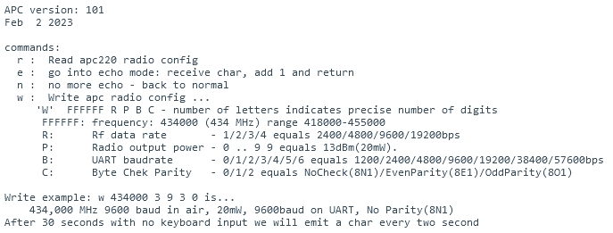
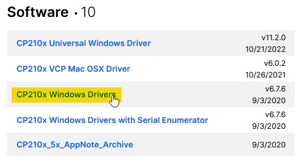
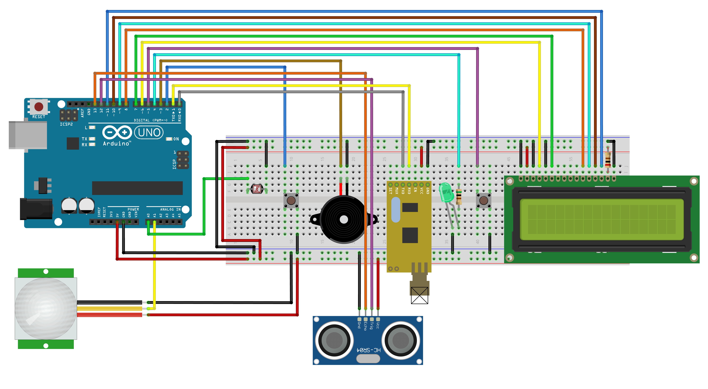

<h1 align="center">Allarme</h1>
<h3 align="center">Progetto di un allarme con Arduino</h2>

<a href="https://www.arduino.cc/">
<a href="https://www.w3.org/TR/html5/">
<a href="https://developer.mozilla.org/en-US/docs/Web/JavaScript">

# Panoramica
Questo progetto consiste nel creare un sistema di allarme utilizzando un microcontrollore (*Arduino*). Il sistema deve essere in grado di ***rilevare*** la presenza di un intruso e di ***avvisare*** l'utente tramite un **suono**, una **luce** e uno schermo **LCD 16x2**.

La rilevazione dell'intruso potrà avvenire nei seguenti modi:
- **Sensore meccanico**: il sensore è posto sul cardine della porta e si attiva quando la porta viene aperta, viene rappresentato da un **pulsante normalmente chiuso**;
- **Sensore sensibile alla luce**: il sensore è posto sul soffitto e si attiva quando la luce viene accesa, viene rappresentato da una **fotoresistenza**;
- **Sensore ostacoli**: il sensore si attiva quando qualcosa si trova nel suo raggio di azione, viene rappresentato da un **sensore ultrasuoni**.
- **Sensore infrarossi**: il sensore si attiva quando rileva il movimento di un corpo caldo, viene rappresentato da un **sensore PIR**. 

Il sistema deve poter essere **attivato** e **disattivato** tramite un ***pulsante*** e deve essere in grado di comunicare con l'utente tramite dei ***moduli radio***.

# Requisiti
## Componenti
- Arduino Uno / Arduino Mega 2560;
- Breadboard;
- 2 pulsanti;
- Sensore ultrasuoni;
- Sensore PIR;
- Fotoresistenza;
- LCD 16x2;
- Moduli radio (**[APC220](https://www.dfrobot.com/product-57.html)**);
- Convertitore UART a USB (**[CP210x](https://www.aliexpress.com/item/32505898388.html)**).

## Software
- **[Arduino IDE](https://www.arduino.cc/en/software)**;
- **Browser basato su Chromium con supporto a Web Serial API** (*[Google Chrome](https://www.google.it/intl/it/chrome/)*, *[Microsoft Edge](https://www.microsoft.com/en-us/edge)*, *[Brave](https://brave.com/it/download/)*, ecc.).

---

## Configurazione modulo APC220
**Scollegare l'APC220 da Arduino prima di procedere.**
1. Caricare lo sketch **[apc220Cfg.ino](arduino/apc220Cfg/apc220Cfg.ino)** su Arduino;
2. Scollegare Arduino dal computer;
3. Collegare l'APC220 ad Arduino sui pin **GND**, **13**, **12**, **11**, **10**, **9** e **8**;
4. Collegare Arduino al computer;
5. Aprire il **Serial Monitor**;
6. Digitare `m` e premere il tasto **Invio**:
   - Dovrebbe apparire un menu come questo:

    

7. Seguire le istruzioni specificate in 'Write example' e, se si desidera, modificare la frequenza:
   - Salvare la frequenza scelta (vi servirà per configurare l'altro modulo APC220);
8. Scollegare Arduino dal computer;
9. Scollegare l'APC220 da Arduino e collegare l'altro modulo APC220 ad Arduino;
10. Ricollegare Arduino al computer;
11. Ripetere i passaggi **6** e **7**.

## Installazione del driver CP210x
Per ricevere i dati dal modulo APC220, è possibile utilizzare un altro Arduino a cui è collegato il modulo APC220 oppure un adattatore **UART-USB**.
Questo progetto è stato progettato per funzionare con l'adattatore **CP210x**.

* Visitare il **[sito web di Silicon Labs](https://www.silabs.com/developers/usb-to-uart-bridge-vcp-drivers?tab=downloads)**;
* Se si utilizza **Windows**, scaricare il driver con il nome `CP210x Windows Drivers`;

    

* Estrarre tutti i file dal file ZIP in una cartella;
* Eseguire il file `CP210xVCPInstaller_x64.exe` e seguire le istruzioni per installare il driver.

---

## Come visualizzare i dati ricevuti dal modulo radio APC220?
Per visualizzare i dati ricevuti dal modulo APC220, è possibile utilizzare un adattatore **UART-USB** (CP210x) o un altro Arduino.

- Collegare l'adattatore o l'Arduino al PC;
- Aprire la pagina web del progetto **[https://coccodrillooxds.github.io/Allarme/](https://coccodrillooxds.github.io/Allarme/)**;
  - *Utilizzare un browser basato su **Chromium** aggiornato all'ultima versione*;
- Cliccare sul pulsante per le impostazioni;
- Selezionare la porta corretta;
- Cliccare su **Connetti**;

Saranno poi visualizzate le informazioni elaborate dal browser. È possibile vedere i dati effettivi ricevuti e inviati cliccando sul pulsante **Terminale**.

---

## Circuito

---

## Contribuire al progetto
È possibile contribuire al progetto creando una **pull request** contenente le modifiche apportate.

## Licenza
Questo progetto è rilasciato sotto licenza **MIT**. Per ulteriori informazioni, consultare il file **[LICENSE](LICENSE)**.